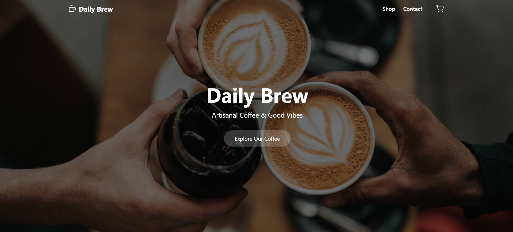
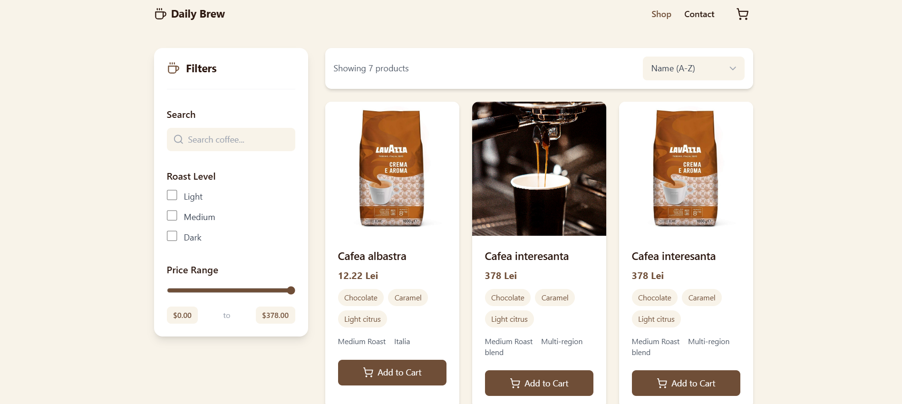
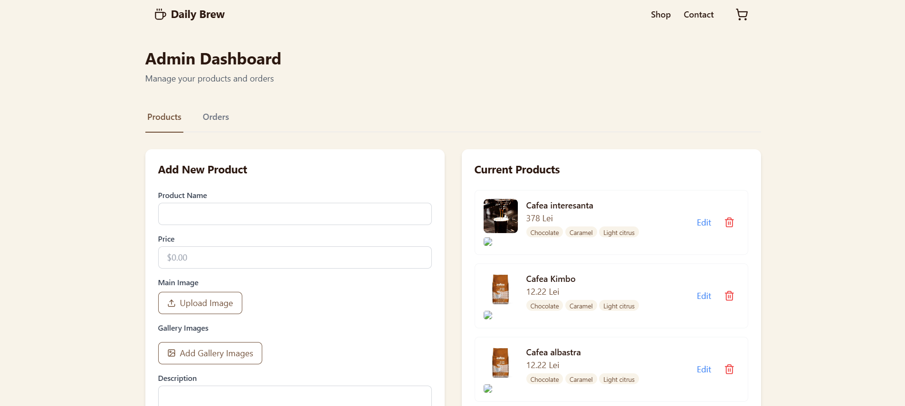
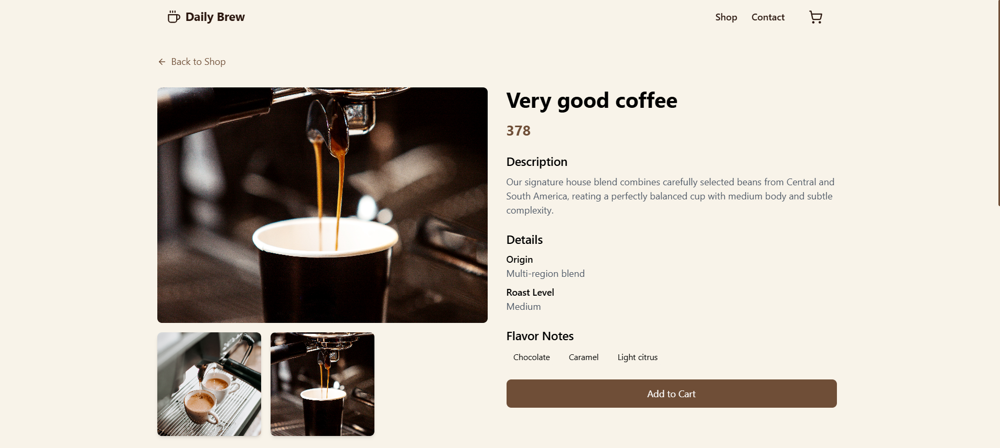
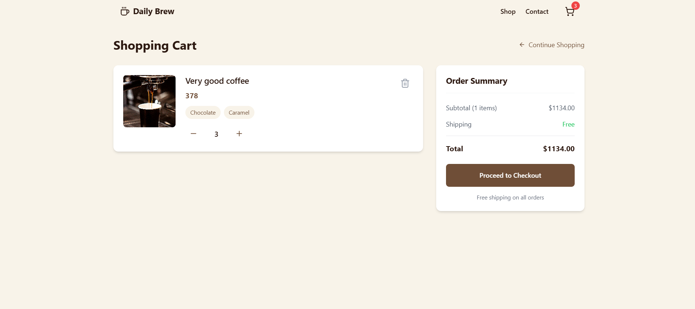
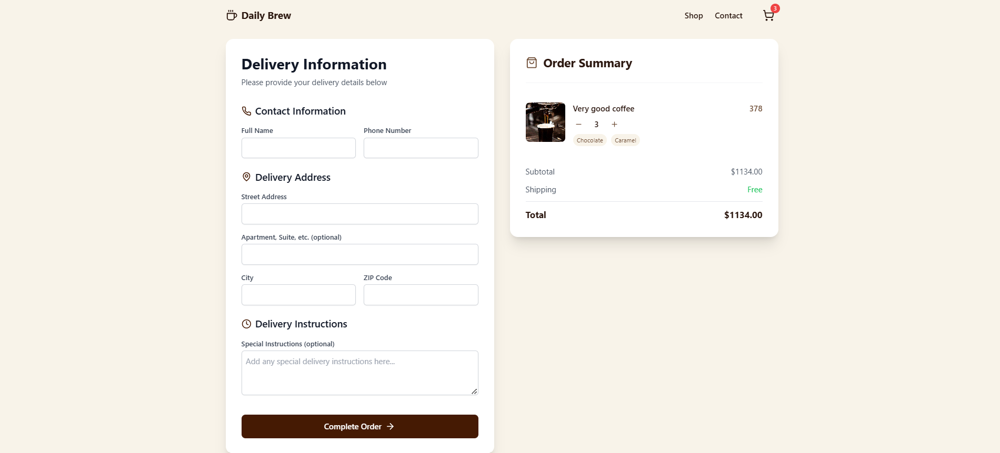
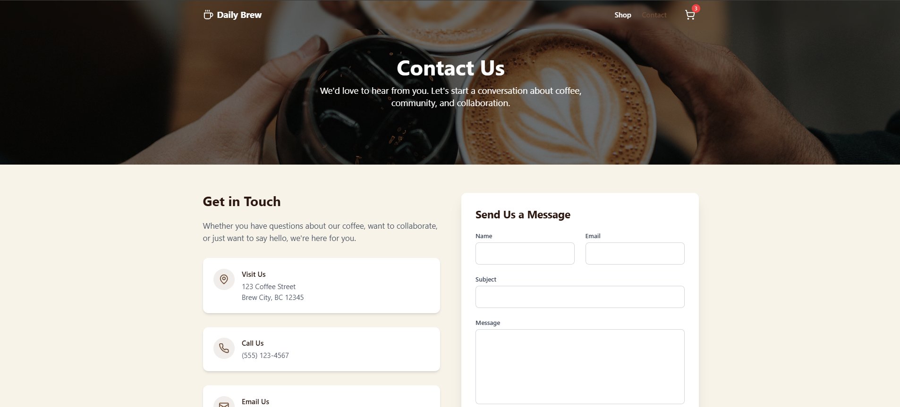
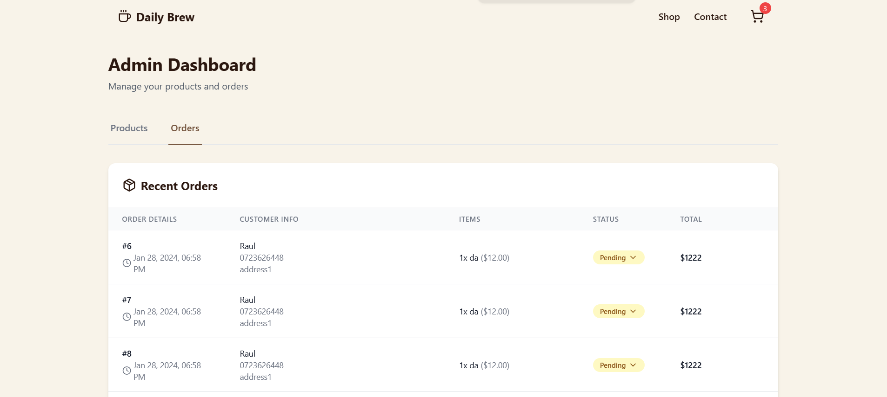

# Daily Brew Coffee Shop

## What is this App
This application is a web-based project built using React, TypeScript, and JavaScript.
It serves as the front-end interface for a coffee shop. Users can browse and order products, view the contact page, 
and access an admin page to manage the shop's offerings. The admin page allows for adding, deleting, 
or editing products, as well as changing the status of orders. The app is designed to be responsive and user-friendly, 
providing a seamless experience across different devices. It integrates with a backend service to fetch and manage data, 
ensuring dynamic and real-time updates.
The project leverages npm for package management, making it easy to install and manage dependencies.

## Installation

1. Clone the repository:
    ```bash
    git clone https://github.com/raulbaciulescu/coffee-shop-fe
    ```
2. Navigate to the project directory:
    ```bash
    cd your-repo
    ```
3. Install the dependencies:
    ```bash
    npm install
    ```

## Usage

1. Start the development server:
    ```bash
    npm start
    ```
2. Open your browser and navigate to `http://localhost:3000`.

## Backend

For the backend side of this application, please visit [Backend Repository](https://github.com/raulbaciulescu/coffee-shop-be).

## Images

Here are some images from the `/images` folder:










